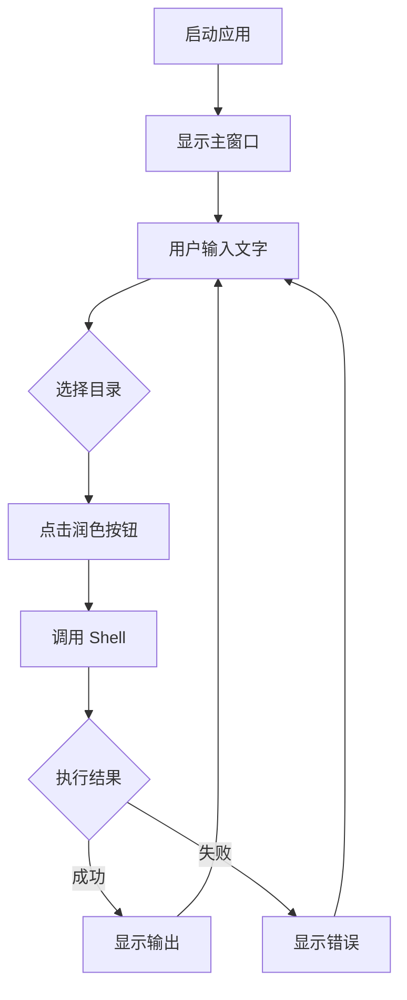
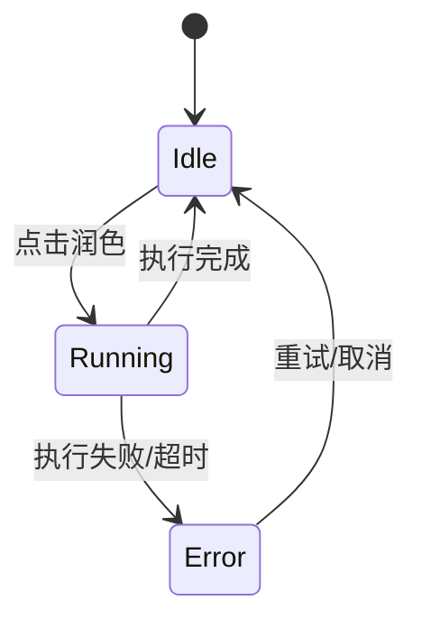
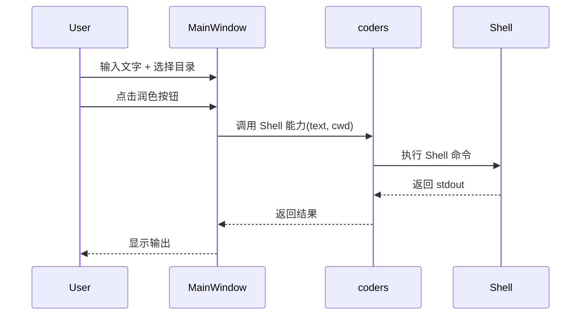

# PLAN-101: 维维美桌面客户端

> updated_by: AI Assistant - Claude-Sonnet-4.5
> updated_at: 2026-04-03 14:57:13

<!-- // 本 Plan 用于指导 WWM 桌面客户端的初始化开发 -->

## Requirements

本需求用于构建一个轻量级桌面客户端（WWM），用于辅助用户进行文字润色工作。

### Goals

- **G-001**：完成 WWM v1.0 MVP 版本开发，包含文本输入、目录选择、Shell 调用三大核心功能
- **G-002**：实现 PyInstaller 打包，支持以独立 exe 运行
- **G-003**：建立 packages 级别的模块引用架构
- **G-004**：在开发过程中和完成后输出文档到 `docs/*`

### Non-Goals

- **NG-001**：不包含系统托盘功能（v2）
- **NG-002**：不包含快捷键全局唤起功能（v2）
- **NG-003**：不包含复杂的设置页面或配置管理（v2）

### Scope

本次交付范围：

- **S-001**：`packages/wwm/main.py` 主程序入口
- **S-002**：`packages/wwm/ui/` UI 模块（主窗口、文本输入、目录选择器）
- **S-003**：`packages/build-wwm.spec` PyInstaller 配置
- **S-004**：`packages/build-wwm.bat` 打包脚本
- **S-005**：`packages/wwm/requirements.txt` 依赖清单
- **S-006**：`docs/*` 开发过程中和完成后的文档输出

### Non-Scope

本次不包含：

- **NS-001**：系统托盘功能
- **NS-002**：全局快捷键

### Functional Requirements

#### 常规（Ubiquitous）需求

- **FR-001**：系统应在启动时显示主窗口
- **FR-002**：系统应提供文本输入区域供用户输入文字
- **FR-003**：系统应提供目录选择按钮，允许用户选择工作目录
- **FR-004**：系统应在用户点击"润"按钮时调用 Shell 命令
- **FR-005**：系统应支持窗口半透明，允许用户透过窗口看到被遮挡的下层内容

#### 事件驱动（Event-Driven）需求

- **FR-010**：当用户点击"润"按钮时，系统应调用 Shell 命令并传入输入文字和工作目录
- **FR-011**：当 Shell 命令执行完成时，系统应在界面上显示输出结果
- **FR-012**：当 Shell 命令执行失败时，系统应显示错误信息

#### 非期望行为（Unwanted Behavior）需求

- **FR-030**：如果 Shell 命令执行超时，系统不得无限等待，应提示用户
- **FR-031**：如果工作目录为空或无效，系统不得执行调用

### Success Metrics

| Metric | Current | Target | How to Measure |
|--------|---------|--------|----------------|
| MVP 功能完成率 | 0 | 100% | 所有 Spec 验收点通过 |
| exe 打包成功率 | N/A | 100% | 生成的 exe 可独立运行 |

### Dependencies

- **D-001**：Shell 命令实现（由用户提供）
- **D-002**：packages/coders 模块可用性

### Constraints

- **C-001**：打包时 packages 作为根目录
- **C-002**：WWM 必须能直接 import packages.coders

### Assumptions

- **A-001**：Shell 命令接受命令行参数或 stdin 方式传参
- **A-002**：Shell 命令返回 stdout 作为输出结果
- **A-003**：用户每次手动选择工作目录，无需持久化

### References

- **REF-001**：`packages/dashboard` 现有实现参考
- **REF-002**：PyInstaller 官方文档

---

## Specs

- [ ] **SPEC-001**：主界面 UI 规格
  - **背景 / 目标**：提供文本输入和润色触发的基础界面
  - **范围**：主窗口、文本输入框、润色按钮、输出显示区
  - **关键决策**：使用 PySide6，与 dashboard 保持一致
  - **实现约束**：
    - 窗口最小尺寸 600x400
    - 窗口必须支持透明（需证明可行）
    - 文本输入支持多行
    - 按钮响应状态（idle/running/error）
  - **接口 / 对接点**：
    - 输入：用户手动输入或粘贴
    - 输出：Shell stdout 结果
  - **命令 / 操作**：
    - 启动应用 → 显示主窗口
    - 点击"润" → 执行 Shell 调用
  - **验收（勾选即证据）**：
    - [ ] 主窗口正常显示
    - [ ] 窗口可设置为半透明
    - [ ] 半透明状态下可透过窗口看到下层内容
    - [ ] 文本输入框可编辑
    - [ ] "润"按钮点击触发 Shell 调用
    - [ ] Shell 结果正确显示

- [ ] **SPEC-002**：工作目录选择器规格
  - **背景 / 目标**：允许用户选择工作目录，用于传给 Shell 命令
  - **范围**：目录选择按钮、目录路径显示
  - **关键决策**：
    - 使用标准库的文件对话框
  - **实现约束**：
    - 点击按钮弹出目录选择对话框
    - 选择后显示完整路径
  - **接口 / 对接点**：
    - 输入：用户点击选择
    - 输出：目录路径字符串，传递给 Shell
  - **命令 / 操作**：
    - 点击"选择目录" → 弹出系统目录选择框
    - 选择后 → 显示路径
  - **验收（勾选即证据）**：
    - [ ] 可正常打开目录选择对话框
    - [ ] 选择后路径正确显示

- [ ] **SPEC-003**：Shell 调用规格
  - **背景 / 目标**：执行 Shell 命令并展示结果
  - **范围**：调用、结果展示、错误处理
  - **关键决策**：
    - Shell 调用由 packages/coders 提供
    - WWM 仅负责调用并展示结果
    - 超时机制由 coders 模块处理
  - **实现约束**：
    - 命令参数：输入文字 + 工作目录
    - 执行时 UI 不可阻塞
  - **接口 / 对接点**：
    - 输入：文字内容、工作目录路径
    - 输出：Shell stdout 输出
  - **命令 / 操作**：
    - 异步执行
    - 捕获输出/错误
  - **验收（勾选即证据）**：
    - [ ] 命令正确执行
    - [ ] 输出正确显示
    - [ ] 错误正确提示
    - [ ] 超时正确处理

- [ ] **SPEC-004**：打包配置规格
  - **背景 / 目标**：生成可独立运行的 exe 文件
  - **范围**：spec 文件配置、build 脚本、依赖管理
  - **关键决策**：
    - packages 作为打包根目录
    - 直接引用 packages.coders
  - **实现约束**：
    - 使用 PyInstaller
    - datas 包含必要的 packages
    - 隐藏 imports 设置
  - **接口 / 对接点**：
    - 输入：源码和依赖
    - 输出：dist/WWM.exe
  - **命令 / 操作**：
    - 运行 build-wwm.bat
    - 生成独立 exe
  - **验收（勾选即证据）**：
    - [ ] build-wwm.bat 可正常执行
    - [ ] 生成 exe 文件
    - [ ] exe 可独立运行
    - [ ] import packages.coders 正常工作

---

## Design

### 设计文档的定位（宏观 / 协调优先）

本文档用于描述 WWM 桌面客户端的系统级设计与对接约定。

### Page & Component Inventory

#### 页面清单（1 个主页面）

> v1.0 只需一个主页面，v2 扩展时增加设置页等

- **P-001 MainWindow**
  - **路由**：直接启动，无路由
  - **入口**：双击 exe 或命令行启动
  - **用户与权限**：普通用户，无需特殊权限
  - **核心区块（页面级组件）**：
    - Header：应用标题栏
    - InputArea：文本输入区域 + 目录选择器
    - ActionArea：润色按钮
    - OutputArea：输出结果显示区
  - **关键状态**：idle / running / success / error
  - **对接点**：依赖 Shell 命令执行结果
  - **埋点/监控**：N/A（v1）

#### 页面流向图



### Architecture Overview

```
wwm/
├── main.py              # 应用入口
└── ui/
    ├── __init__.py
    ├── main_window.py    # 主窗口
    └── styles.py         # 样式定义
```

> **注意**：Shell 调用能力由 packages/coders 提供，WWM 仅负责调用

### State Machine



### Sequence Diagrams

### UC-001 润色执行流程



### 关键设计决策

1. **UI 框架**：PySide6（与 dashboard 一致）
2. **窗口透明**：使用 PySide6 的 setWindowOpacity 或 FramelessWindow + 透明背景实现
3. **Shell 调用**：由 packages/coders 提供，WWM 仅负责调用
4. **无需配置持久化**：用户每次手动选择工作目录

---

## Phases

### PHASE-100: 项目基础结构搭建（含打包配置）

本 Phase 聚焦于建立 WWM 项目的基础文件结构、依赖配置和打包配置。

- [ ] **创建项目目录结构**：在 `packages/wwm/` 下建立 `main.py`、`ui/` 等基础文件
- [ ] **配置 requirements.txt**：定义 PySide6 等依赖
- [ ] **参考 dashboard 的 UI 模式**：学习 dashboard 的 UI 组织方式，但仅复制必要的部分
- [ ] **创建 build-wwm.spec**：配置 PyInstaller spec 文件，设置 packages 为根目录
- [ ] **创建 build-wwm.bat**：编写打包脚本
- [ ] **输出阶段文档**：如有需要，输出本阶段的架构设计文档到 `docs/*`

### PHASE-200: 主界面 UI 开发

本 Phase 聚焦于实现主界面 UI 组件。

- [ ] **实现主窗口**：使用 PySide6 创建主窗口，设置基本布局和尺寸
- [ ] **实现文本输入区域**：添加多行文本输入框
- [ ] **实现目录选择器**：使用文件对话框添加目录选择功能
- [ ] **实现润色按钮**：添加按钮，点击触发 Shell 调用
- [ ] **实现输出显示区**：添加结果显示区域
- [ ] **输出阶段文档**：如有需要，输出本阶段的 UI 设计文档到 `docs/*`

### PHASE-300: Shell 调用集成

本 Phase 聚焦于集成 coders 模块的 Shell 调用能力。

- [ ] **集成 Shell 调用**：调用 packages/coders 提供的 Shell 能力
- [ ] **处理错误情况**：捕获并展示执行错误
- [ ] **异步执行**：确保 UI 在执行期间不阻塞
- [ ] **输出阶段文档**：如有需要，输出本阶段的技术设计文档到 `docs/*`

### PHASE-400: 验收与交付

本 Phase 聚焦于最终验收和交付。

- [ ] **功能验收**：所有 Spec 验收点通过
- [ ] **打包验收**：执行 build-wwm.bat，验证 exe 可独立运行，无依赖问题
- [ ] **验证 import 正常**：确保 packages.coders 可正常引用
- [ ] **输出最终文档**：整理并输出项目文档到 `docs/*`，包含但不限于：README、架构设计、coders 接口调用文档
- [ ] **文档更新**：更新 README 或相关文档

---

<!-- // 以下留空 -->
